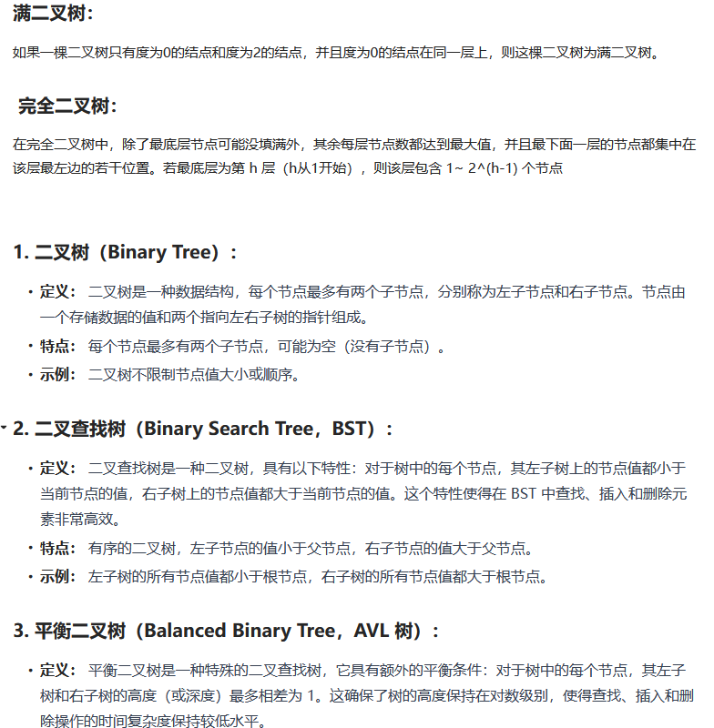

### 二叉树

###### 1、基本概念



* ```java
  * 二叉树
  * 满二叉树
  * 完全二叉树
  * 二叉搜索树
  * 平衡二叉搜索树
  * 红黑树
  ```

###### 2、二叉树的存储方式

* **二叉树可以链式存储（链表），也可以顺序存储（数组）。**

###### 3、遍历方式

* 深度优先遍历：先往深走，遇到叶子节点再往回走。

* ```java
  深度优先：    
  	前序遍历（递归法，迭代法）  根左右
      中序遍历（递归法，迭代法）  左根右
      后序遍历（递归法，迭代法）  左右根
  广度优先：层次遍历（迭代法）
  ```

* 广度优先遍历：一层一层的去遍历。

###### 4、java定义二叉树

* ```java
  public class TreeNode {
      int val;
      TreeNode left;
      TreeNode right;
      TreeNode() {}
      TreeNode(int val) {this.val = val;}
      TreeNode(int val, TreeNode left, TreeNode right) {
          this.val = val;
          this.left = left;
          this.right = right;
      }
  }
  ```

* 前序中序后序

* ```java
  1、确定递归函数的参数和返回值：
      因为要打印出前序遍历节点的数值，所以参数里需要传入vector来放节点的数值，     除了这一点就不需要再处理什么数据了也不需要有返回值，所以递归函数返回类型     就是void
  2、确定终止条件：
      在递归的过程中，如何算是递归结束了呢，当然是当前遍历的节点是空了，那么本     层递归就要结束了，所以如果当前遍历的这个节点是空，就直接return
  3、确定单层递归的逻辑：前序遍历是中左右的循序，所以在单层递归的逻辑，是要先取中节点的数值
  ```

* ```java
  class Solution {
      public List<Integer> preorderTraversal(TreeNode root) {
          List<Integer> result = new ArrayList<Integer>();
          preorder(root, result);
          return result;
      }
      // 前序
      public void preorder(TreeNode root, List<Integer> result) {
          if(root == null) {
              return;
          } 
          result.add(root.val);
          preorder(root.left, result);
          preorder(root.right, result);
      }
      // 中序和后序
  }
  ```

* 

