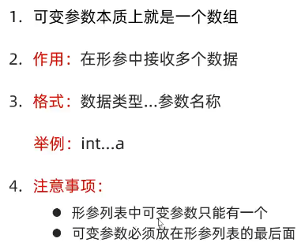
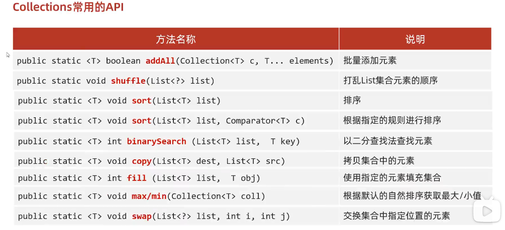

### hashMap源码

* putVal（）

* ```java
  //resize()
  // 初始情况
  newCap = DEFAULT_INITIAL_CAPACITY;  // 16
  //加载因子0.75  当数组长度>12时，也就是0.75x16=12,开始扩容
  newThr = (int)(DEFAULT_LOAD_FACTOR * DEFAULT_INITIAL_CAPACITY); 
  // TREEIFY_THRESHOLD为8，超过8就会调用treeifyBin 红黑树
  treeifyBin(tab, hash)
   if (++size > threshold)  // threshold=12
       resize();
  
  ///////////////////////////////////////////////////////////////////
  1.看源码之前需要了解的一些内容
  
  Node<K,V>[] table   哈希表结构中数组的名字
  DEFAULT_INITIAL_CAPACITY：   数组默认长度16
  DEFAULT_LOAD_FACTOR：        默认加载因子0.75
  
  HashMap里面每一个对象包含以下内容：
  1.1 链表中的键值对对象
      包含：  
  		   int hash;         //键的哈希值
              final K key;      //键
              V value;          //值
              Node<K,V> next;   //下一个节点的地址值
  		
  1.2 红黑树中的键值对对象
  	包含：
  		   int hash;         	    //键的哈希值
              final K key;      		//键
              V value;         	 	//值
              TreeNode<K,V> parent;  	//父节点的地址值
  		   TreeNode<K,V> left;	   //左子节点的地址值
  		   TreeNode<K,V> right;	   //右子节点的地址值
  		   boolean red;			  //节点的颜色
  ```

* ```java
  添加元素的时候至少考虑三种情况：
  2.1数组位置为null
  2.2数组位置不为null，键不重复，挂在下面形成链表或者红黑树
  2.3数组位置不为null，键重复，元素覆盖
  
  
  //参数一：键
  //参数二：值
  
  //返回值：被覆盖元素的值，如果没有覆盖，返回null
  public V put(K key, V value) {
      return putVal(hash(key), key, value, false, true);
  }
  
  //利用键计算出对应的哈希值，再把哈希值进行一些额外的处理
  //简单理解：返回值就是返回键的哈希值
  static final int hash(Object key) {
      int h;
      return (key == null) ? 0 : (h = key.hashCode()) ^ (h >>> 16);
  }
  
  //参数一：键的哈希值
  //参数二：键
  //参数三：值
  //参数四：如果键重复了是否保留
  // true，表示老元素的值保留，不会覆盖
  // false，表示老元素的值不保留，会进行覆盖
  final V putVal(int hash, K key, V value, boolean onlyIfAbsent,boolean evict) {
  	    //定义一个局部变量，用来记录哈希表中数组的地址值。
          Node<K,V>[] tab;
  		
  		//临时的第三方变量，用来记录键值对对象的地址值
          Node<K,V> p;
          
  		//表示当前数组的长度
  		int n;
  		
  		//表示索引
          int i;
  		
  		//把哈希表中数组的地址值，赋值给局部变量tab
  		tab = table;
  
          if (tab == null || (n = tab.length) == 0){
  			//1.如果当前是第一次添加数据，底层会创建一个默认长度为16，加载因子为0.75的数组
  			//2.如果不是第一次添加数据，会看数组中的元素是否达到了扩容的条件
  			//如果没有达到扩容条件，底层不会做任何操作
  			//如果达到了扩容条件，底层会把数组扩容为原先的两倍，并把数据全部转移到新的哈希表中
  			tab = resize();
  			//表示把当前数组的长度赋值给n
              n = tab.length;
          }
  
  		//拿着数组的长度跟键的哈希值进行计算，计算出当前键值对对象，在数组中应存入的位置
  		i = (n - 1) & hash;//index
  		//获取数组中对应元素的数据
  		p = tab[i];
  		
  		
          if (p == null){
  			//底层会创建一个键值对对象，直接放到数组当中
              tab[i] = newNode(hash, key, value, null);
          }else {
              Node<K,V> e;
              K k;
  			
  			//等号的左边：数组中键值对的哈希值
  			//等号的右边：当前要添加键值对的哈希值
  			//如果键不一样，此时返回false
  			//如果键一样，返回true
  			boolean b1 = p.hash == hash;
  			
              if (b1 && ((k = p.key) == key || (key != null && key.equals(k)))){
                  e = p;
              } else if (p instanceof TreeNode){
  				//判断数组中获取出来的键值对是不是红黑树中的节点
  				//如果是，则调用方法putTreeVal，把当前的节点按照红黑树的规则添加到树当中。
                  e = ((TreeNode<K,V>)p).putTreeVal(this, tab, hash, key, value);
              } else {
  				//如果从数组中获取出来的键值对不是红黑树中的节点
  				//表示此时下面挂的是链表
                  for (int binCount = 0; ; ++binCount) {
                      if ((e = p.next) == null) {
  						//此时就会创建一个新的节点，挂在下面形成链表
                          p.next = newNode(hash, key, value, null);
  						//判断当前链表长度是否超过8，如果超过8，就会调用方法treeifyBin
  						//treeifyBin方法的底层还会继续判断
  						//判断数组的长度是否大于等于64
  						//如果同时满足这两个条件，就会把这个链表转成红黑树
                          if (binCount >= TREEIFY_THRESHOLD - 1)
                              treeifyBin(tab, hash);
                          break;
                      }
  					//e：			  0x0044  ddd  444
  					//要添加的元素： 0x0055   ddd   555
  					//如果哈希值一样，就会调用equals方法比较内部的属性值是否相同
                      if (e.hash == hash && ((k = e.key) == key || (key != null && key.equals(k)))){
  						 break;
  					}
  
                      p = e;
                  }
              }
  			
  			//如果e为null，表示当前不需要覆盖任何元素
  			//如果e不为null，表示当前的键是一样的，值会被覆盖
  			//e:0x0044  ddd  555
  			//要添加的元素： 0x0055   ddd   555
              if (e != null) {
                  V oldValue = e.value;
                  if (!onlyIfAbsent || oldValue == null){
  					
  					//等号的右边：当前要添加的值
  					//等号的左边：0x0044的值
  					e.value = value;
  				}
                  afterNodeAccess(e);
                  return oldValue;
              }
          }
  		
          //threshold：记录的就是数组的长度 * 0.75，哈希表的扩容时机  16 * 0.75 = 12
          if (++size > threshold){
  			 resize();
  		}
          
  		//表示当前没有覆盖任何元素，返回null
          return null;
      }
  
  ```

* 


## 1.Map集合

### 1.1Map集合概述和特点【理解】

- Map集合概述

  ```java
  interface Map<K,V>  K：键的类型；V：值的类型
  ```

- Map集合的特点

  - 双列集合,一个键对应一个值
  - 键不可以重复,值可以重复

- Map集合的基本使用

  ```java
  public class MapDemo01 {
      public static void main(String[] args) {
          //创建集合对象
          Map<String,String> map = new HashMap<String,String>();
  
          //V put(K key, V value) 将指定的值与该映射中的指定键相关联
          map.put("itheima001","林青霞");
          map.put("itheima002","张曼玉");
          map.put("itheima003","王祖贤");
          map.put("itheima003","柳岩");
  
          //输出集合对象
          System.out.println(map);
      }
  }
  ```

### 1.2Map集合的基本功能【应用】

- 方法介绍

  | 方法名                                 | 说明                 |
  | ----------------------------------- | ------------------ |
  | V   put(K key,V   value)            | 添加元素               |
  | V   remove(Object key)              | 根据键删除键值对元素         |
  | void   clear()                      | 移除所有的键值对元素         |
  | boolean containsKey(Object key)     | 判断集合是否包含指定的键       |
  | boolean containsValue(Object value) | 判断集合是否包含指定的值       |
  | boolean isEmpty()                   | 判断集合是否为空           |
  | int size()                          | 集合的长度，也就是集合中键值对的个数 |

- 示例代码

  ```java
  public class MapDemo02 {
      public static void main(String[] args) {
          //创建集合对象
          Map<String,String> map = new HashMap<String,String>();
  
          //V put(K key,V value)：添加元素
          map.put("张无忌","赵敏");
          map.put("郭靖","黄蓉");
          map.put("杨过","小龙女");
  
          //V remove(Object key)：根据键删除键值对元素
  //        System.out.println(map.remove("郭靖"));
  //        System.out.println(map.remove("郭襄"));
  
          //void clear()：移除所有的键值对元素
  //        map.clear();
  
          //boolean containsKey(Object key)：判断集合是否包含指定的键
  //        System.out.println(map.containsKey("郭靖"));
  //        System.out.println(map.containsKey("郭襄"));
  
          //boolean isEmpty()：判断集合是否为空
  //        System.out.println(map.isEmpty());
  
          //int size()：集合的长度，也就是集合中键值对的个数
          System.out.println(map.size());
  
          //输出集合对象
          System.out.println(map);
      }
  }
  ```

### 1.3Map集合的获取功能【应用】

- 方法介绍

  | 方法名                              | 说明           |
  | -------------------------------- | ------------ |
  | V   get(Object key)              | 根据键获取值       |
  | Set<K>   keySet()                | 获取所有键的集合     |
  | Collection<V>   values()         | 获取所有值的集合     |
  | Set<Map.Entry<K,V>>   entrySet() | 获取所有键值对对象的集合 |

- 示例代码

  ```java
  public class MapDemo03 {
      public static void main(String[] args) {
          //创建集合对象
          Map<String, String> map = new HashMap<String, String>();
  
          //添加元素
          map.put("张无忌", "赵敏");
          map.put("郭靖", "黄蓉");
          map.put("杨过", "小龙女");
  
          //V get(Object key):根据键获取值
  //        System.out.println(map.get("张无忌"));
  //        System.out.println(map.get("张三丰"));
  
          //Set<K> keySet():获取所有键的集合
  //        Set<String> keySet = map.keySet();
  //        for(String key : keySet) {
  //            System.out.println(key);
  //        }
  
          //Collection<V> values():获取所有值的集合
          Collection<String> values = map.values();
          for(String value : values) {
              System.out.println(value);
          }
      }
  }
  ```

### 1.4Map集合的遍历(方式1)【应用】

- 遍历思路

  - 我们刚才存储的元素都是成对出现的，所以我们把Map看成是一个夫妻对的集合
    - 把所有的丈夫给集中起来
    - 遍历丈夫的集合，获取到每一个丈夫
    - 根据丈夫去找对应的妻子

- 步骤分析

  - 获取所有键的集合。用keySet()方法实现
  - 遍历键的集合，获取到每一个键。用增强for实现  
  - 根据键去找值。用get(Object key)方法实现

- 代码实现

  ```java
  public class MapDemo01 {
      public static void main(String[] args) {
          //创建集合对象
          Map<String, String> map = new HashMap<String, String>();
  
          //添加元素
          map.put("张无忌", "赵敏");
          map.put("郭靖", "黄蓉");
          map.put("杨过", "小龙女");
  
          //获取所有键的集合。用keySet()方法实现
          Set<String> keySet = map.keySet();
          //遍历键的集合，获取到每一个键。用增强for实现
          for (String key : keySet) {
              //根据键去找值。用get(Object key)方法实现
              String value = map.get(key);
              System.out.println(key + "," + value);
          }
      }
  }
  ```

### 1.5Map集合的遍历(方式2)【应用】

- 遍历思路

  - 我们刚才存储的元素都是成对出现的，所以我们把Map看成是一个夫妻对的集合
    - 获取所有结婚证的集合
    - 遍历结婚证的集合，得到每一个结婚证
    - 根据结婚证获取丈夫和妻子

- 步骤分析

  - 获取所有键值对对象的集合
    - Set<Map.Entry<K,V>> entrySet()：获取所有键值对对象的集合
  - 遍历键值对对象的集合，得到每一个键值对对象
    - 用增强for实现，得到每一个Map.Entry
  - 根据键值对对象获取键和值
    - 用getKey()得到键
    - 用getValue()得到值

- 代码实现

  ```java
  public class MapDemo02 {
      public static void main(String[] args) {
          //创建集合对象
          Map<String, String> map = new HashMap<String, String>();
  
          //添加元素
          map.put("张无忌", "赵敏");
          map.put("郭靖", "黄蓉");
          map.put("杨过", "小龙女");
  
          //获取所有键值对对象的集合
          Set<Map.Entry<String, String>> entrySet = map.entrySet();
          //遍历键值对对象的集合，得到每一个键值对对象
          for (Map.Entry<String, String> me : entrySet) {
              //根据键值对对象获取键和值
              String key = me.getKey();
              String value = me.getValue();
              System.out.println(key + "," + value);
          }
      }
  }
  ```

## 2.HashMap集合

### 2.1HashMap集合概述和特点【理解】

+ HashMap底层是哈希表结构的
+ 依赖hashCode方法和equals方法保证键的唯一
+ 如果键要存储的是自定义对象，需要重写hashCode和equals方法

### 2.2HashMap集合应用案例【应用】

- 案例需求

  - 创建一个HashMap集合，键是学生对象(Student)，值是居住地 (String)。存储多个元素，并遍历。
  - 要求保证键的唯一性：如果学生对象的成员变量值相同，我们就认为是同一个对象

- 代码实现

  学生类

  ```java
  public class Student {
      private String name;
      private int age;
  
      public Student() {
      }
  
      public Student(String name, int age) {
          this.name = name;
          this.age = age;
      }
  
      public String getName() {
          return name;
      }
  
      public void setName(String name) {
          this.name = name;
      }
  
      public int getAge() {
          return age;
      }
  
      public void setAge(int age) {
          this.age = age;
      }
  
      @Override
      public boolean equals(Object o) {
          if (this == o) return true;
          if (o == null || getClass() != o.getClass()) return false;
  
          Student student = (Student) o;
  
          if (age != student.age) return false;
          return name != null ? name.equals(student.name) : student.name == null;
      }
  
      @Override
      public int hashCode() {
          int result = name != null ? name.hashCode() : 0;
          result = 31 * result + age;
          return result;
      }
  }
  ```

  测试类

  ```java
  public class HashMapDemo {
      public static void main(String[] args) {
          //创建HashMap集合对象
          HashMap<Student, String> hm = new HashMap<Student, String>();
  
          //创建学生对象
          Student s1 = new Student("林青霞", 30);
          Student s2 = new Student("张曼玉", 35);
          Student s3 = new Student("王祖贤", 33);
          Student s4 = new Student("王祖贤", 33);
  
          //把学生添加到集合
          hm.put(s1, "西安");
          hm.put(s2, "武汉");
          hm.put(s3, "郑州");
          hm.put(s4, "北京");
  
          //遍历集合
          Set<Student> keySet = hm.keySet();
          for (Student key : keySet) {
              String value = hm.get(key);
              System.out.println(key.getName() + "," + key.getAge() + "," + value);
          }
      }
  }
  ```

## 3.TreeMap集合

### 3.1TreeMap集合概述和特点【理解】

+ TreeMap底层是红黑树结构
+ 依赖自然排序或者比较器排序,对键进行排序
+ 如果键存储的是自定义对象,需要实现Comparable接口或者在创建TreeMap对象时候给出比较器排序规则

### 3.2TreeMap集合应用案例【应用】

+ 案例需求

  + 创建一个TreeMap集合,键是学生对象(Student),值是籍贯(String),学生属性姓名和年龄,按照年龄进行排序并遍历
  + 要求按照学生的年龄进行排序,如果年龄相同则按照姓名进行排序

+ 代码实现

  学生类

  ```java
  public class Student implements Comparable<Student>{
      private String name;
      private int age;
  
      public Student() {
      }
  
      public Student(String name, int age) {
          this.name = name;
          this.age = age;
      }
  
      public String getName() {
          return name;
      }
  
      public void setName(String name) {
          this.name = name;
      }
  
      public int getAge() {
          return age;
      }
  
      public void setAge(int age) {
          this.age = age;
      }
  
      @Override
      public String toString() {
          return "Student{" +
                  "name='" + name + '\'' +
                  ", age=" + age +
                  '}';
      }
  
      @Override
      public int compareTo(Student o) {
          //按照年龄进行排序
          int result = o.getAge() - this.getAge();
          //次要条件，按照姓名排序。
          result = result == 0 ? o.getName().compareTo(this.getName()) : result;
          return result;
      }
  }
  ```

  测试类

  ```java
  public class Test1 {
      public static void main(String[] args) {
        	// 创建TreeMap集合对象
          TreeMap<Student,String> tm = new TreeMap<>();
        
  		// 创建学生对象
          Student s1 = new Student("xiaohei",23);
          Student s2 = new Student("dapang",22);
          Student s3 = new Student("xiaomei",22);
        
  		// 将学生对象添加到TreeMap集合中
          tm.put(s1,"江苏");
          tm.put(s2,"北京");
          tm.put(s3,"天津");
        
  		// 遍历TreeMap集合,打印每个学生的信息
          tm.forEach(
                  (Student key, String value)->{
                      System.out.println(key + "---" + value);
                  }
          );
      }
  }
  ```

* 可变参数
* 
* Collections
* 
