## **集合**

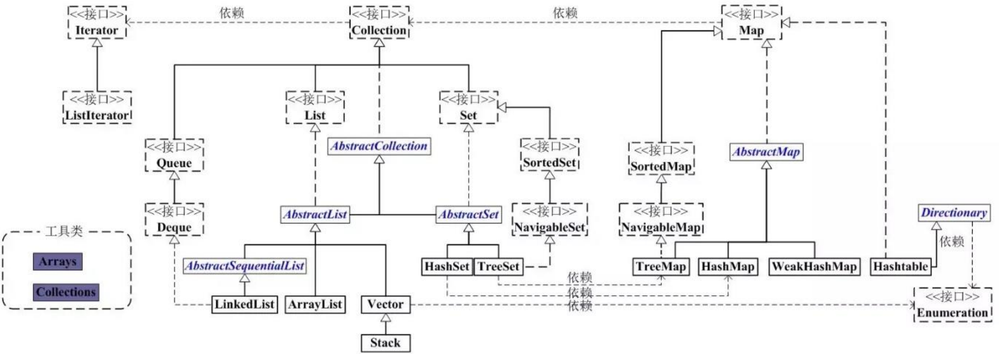

#### Collection

* ####  List

  * 特点： 元素有序，但是可以重复。

  * 线程安全的：Vector（没有扩容因子，无参构造情况下初始10，增量为0，复制2倍）、

  * ```
    int newCapacity = oldCapacity + ((capacityIncrement > 0) ?
                                     capacityIncrement : oldCapacity);
    ```

    ​                        CopyAndWriterArrayList(写时复制)、

    ​                        Collections.synchronziedList(List list)

  * 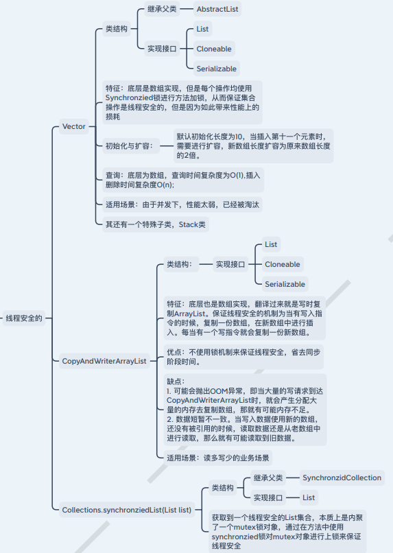
    * 线程不安全的：ArrayList（没有扩容因子，无参构造情况下初始10，1.5倍）
    
      ​                             LinkedList,实现接口Deque（父接口为Queue）
    
    * ```java
      int newCapacity = oldCapacity + (oldCapacity >> 1);   // ArrayList
      ```
    
    * 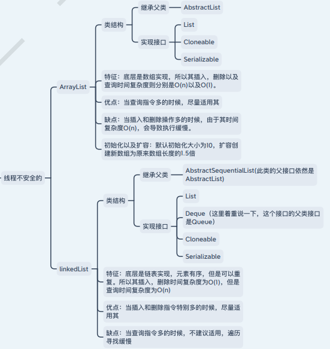

* #### Set

  * 特点 元素不能重复，⽽且⽆序
  * 线程安全的：CopyAndWriterArraySet、Collections.synchronziedSet(Set set)
  * 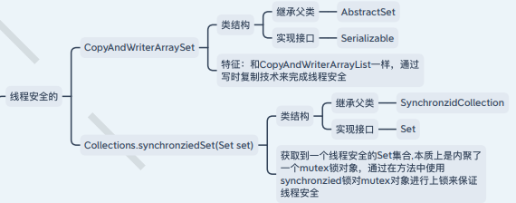
  * 线程不安全的：TreeSet、HashSet、LinkedHashSet
  * 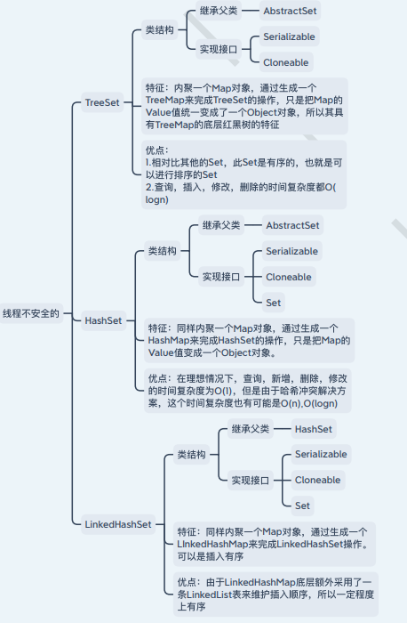

* Queue: 类LinkedList实现Deque接口，Deque接口实现了Queue接口

#### Map

* 线程安全的：Hashtable、Collections.synchronizedMap(new HashMap<>())、

  ​                        ConcurrentHashMap

* 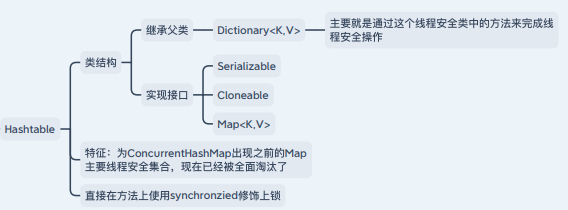

* 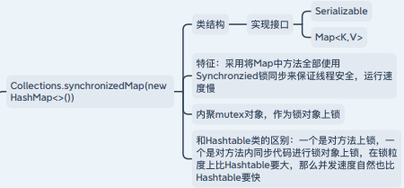

* 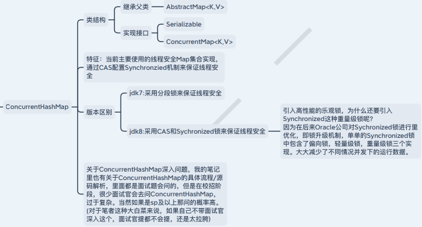

* 线程不安全的：HashMap、LinkedHashMap、TreeMap

* 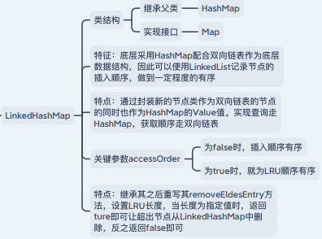

* 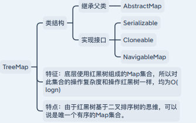

* HashMap

  * 类结构：继承⽗类 AbstractMap ，实现接⼝ Serializable Cloneable Map

  * 特征：底层采⽤哈希表配合链表，红⿊树组成。 ⽽且容量必须为2的次⽅数，会通过多次右移运 算符算法完成输⼊容量向最近的上界2的次⽅数 转化。初始容量为16

  * 扩容因⼦0.75：

    * ```txt
      关于扩容因⼦为什么规定为0.75，这其实是⼀个数学分析问题，也就是泊松分布
      
      只有当扩容因⼦为0.75的时候，才能保证在正常情况下桶中元素个数不会超过8个，当然极端情况是会超过8个的，所以jdk8采⽤红⿊树进⾏了优化。扩容因⼦可以说是内存空间利⽤率和哈希冲突率之间的权衡，如果我们把扩容因⼦的值设置的很⼩，那么在哈希表中所含元素很少的时候，哈希表就会进⾏扩容，翻倍成原来的2倍⻓度，这样降低哈希冲突概率，但是内存空间使⽤率低了很多。
      
      反之如果扩容因⼦设置的很⾼，那么虽然空间使⽤率上来，但是哈希冲突率直接上升。所以太⾼太低是不⾏的，最后经过⼤量测试规定在了0.75
      
      ```

  * 容量必须为2的次⽅数

    * 计算桶的位置

    * ```txt
      计算桶的位置
      
      正常在哈希表理论计算的时候，我们计算桶位置⾸先会通过hashCode⽅法计算出Hash值，然后通过此Hash值与数组⻓度-1进⾏求摸运算，然后得到相应的桶位置。但是在HashMap中⾸先优化了求Hash值的⽅法，虽然还是会使⽤HashCode获取到哈希值，但是会通过Hash >>> 16（⽆符号右移）的⽅式，让⾼16位到达低16位，为什么这样做呢？主要是给我们下⼀步优化做铺垫，也就是关键的⽤&替换掉求摸运算，即hash & (length -1)；只有在哈希数组⻓度在2的次⽅数时，才能完全替换掉公式。那么为什么Hash >>> 16 是给Hash &(length - 1)做铺垫呢？ 因为如果换成&运算，那么⽐较的就是⼆进制码，当数组⻓度⽐较⼩的时候，⾼位16位均为0，低位才有变化。所以为了降低哈希冲突率，使⽤Hash >>> 16吧hash值的⾼位移动到低位
      ```

    * 扩容优化：数组翻倍和数据迁移

    * 数组翻倍：由于HashMap是线程不安全的，不需要考虑多个 线程同时参与扩容时，⽣成多个新数组的情况， 所以直接翻倍后引⽤即可。

    * 数据迁移：

      * ```txt
        迁移的核⼼算法就是：
        hash & length 的值，如果结果为1，那么就需要重新计算其Hash值对应位置，但是如果结果为0，那么其位置不⽤动即可。那么这个结果为什么可以做这个判断呢？这其实和length-1，length两个值的⼆进制码有关，我们举个例⼦，16的⼆进制码为10000，那么length-1也就是15的⼆进制码为1111，那么翻倍之后32的⼆进制码为100000，31的⼆进制码为11111，那么两者之间和Hash进⾏&运算的差别就在于，Hash值第五位⼆进制码到底是1还是0，如果是0的话，那么和15，31的计算结果不变，如果为1的话，那就会改变结果。⽽hash & length 就可以知道Hash值的第5位到底是0还是1。
        ```

  * put⽅法具体流程:

    * 1.⾸先会去检测哈希数组是否初始化，没有就初始化 
    * 2.计算key值所在桶位置 
    * 3.检查当前桶位置是否有元素，没有元素直接插 ⼊
    * 4.当桶位置有元素时，判断是链表节点还是红⿊树节点 
    * 5.如果是链表节点，则进⾏遍历查询插⼊位置， 如果有节点和key相同，则替换value，并返回替换的value。反之直接插⼊到末尾 
    * 6.如果是红⿊树节点，那么进行红⿊树插⼊流程

  * 红黑树插入流程

    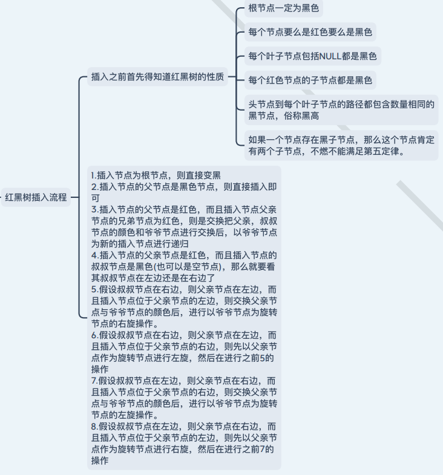