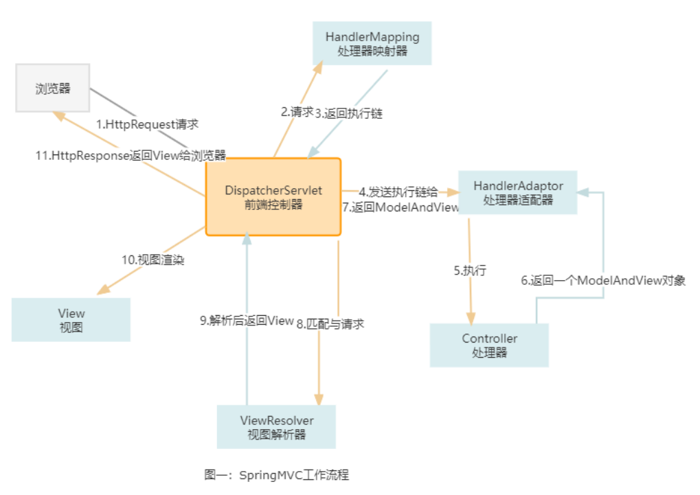

#### 流程

1. 用户通过浏览器发起 HttpRequest 请求到前端控制器 (DispatcherServlet)。

2. DispatcherServlet 将用户请求发送给处理器映射器 (HandlerMapping)。

3. 处理器映射器 (HandlerMapping)会根据请求，找到负责处理该请求的处理器，并将其封装为处理器执行链 返回(HandlerExecutionChain)给 DispatcherServlet

4. DispatcherServlet 会根据 处理器执行链 中的处理器，找到能够执行该处理器的处理器适配器(HandlerAdaptor) --注，处理器适配器有多个

5. 处理器适配器 (HandlerAdaptoer) 会调用对应的具体的 Controller

6. Controller 将处理结果及要跳转的视图封装到一个对象ModelAndView 中并将其返回给处理器适配器(HandlerAdaptor)

7. HandlerAdaptor 直接将 ModelAndView 交给 DispatcherServlet ，至此，业务处理完毕

8. 业务处理完毕后，我们需要将处理结果展示给用户。于是DisptcherServlet 调用ViewResolver，将 ModelAndView 中的视图名称封装为视图对象

9. ViewResolver 将封装好的视图 (View) 对象返回给 DispatcherServlet

10. DispatcherServlet 调用视图对象，让其自己 (View) 进行渲染（将模型数据填充至视图中），形成响应对象 (HttpResponse)

11. 前端控制器 (DispatcherServlet) 响应 (HttpResponse) 给浏览器，展示在页面上。


#### 代码流程

```java
doService ==> doDispatch
    
// 返回执行链
mappedHandler = getHandler(processedRequest);

// 发送执行链给HandleAdaptor,返回modelAndView
// 决定使用哪个handleAdaptor
HandlerAdapter ha = this.getHandlerAdapter(mappedHandler.getHandler());
// 拦截器方法
if (!mappedHandler.applyPreHandle(processedRequest, response))  {return;}
// 具体执行Controller，返回一个ModelAndView
 mv = ha.handle(processedRequest, response, mappedHandler.getHandler());
// 拦截器方法
mappedHandler.applyPostHandle(processedRequest, response, mv);
// preHandle,postHandle,afterHandler都是在HandlerExecutionChain类里面


```

