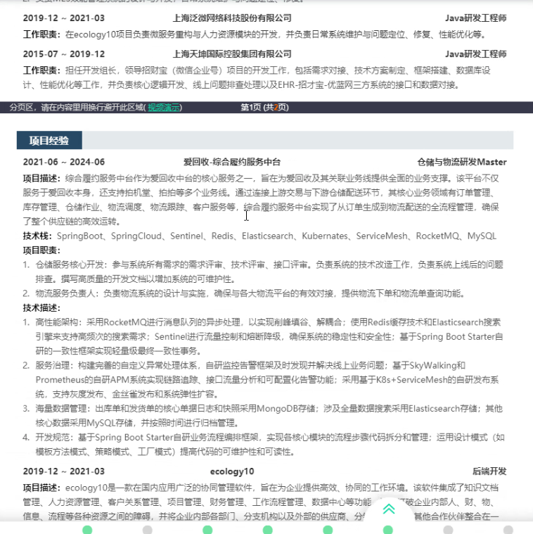

# 8.27 简历修改

荣誉、证书和教育背景合并，前置。

金融挑战赛 针对不同公司进行

党员、籍贯、民族

教育背景下面放个人证书和荣誉

自我评价放在最后面

面试80%来自简历

JVM的内存结构，常见的垃圾回收算法和类加载机制

简历名词的大小写

实习经历

工作内容、工作职责，，承担了什么职责  （我写的太细了）

![image-20240827215340529](./assets/image-20240827215340529.png

两个月的内容太多，6个月的内容少

加一栏自我评价；

# 8.28 多线程

 threadLocal

常用并发类：Semaphore、CountDownLatch

AQS：特性和核心结构

阻塞队列

redis的key怎么设计，放菜单信息，如果修改了怎么触发更新redis呢。  业务场景

缓存空数据，怎么知道查的是恶意的查询，或者说什么情况下缓存空数据

volatile 保证可见性和有序性、不能保证原子性

每个线程有个独立的map

cas比较次数多了，性能下降

先介绍，再比较。分维度

使用层面：代码块，JVM进行加锁和解锁；都是可重入

实现原理：基于操作系统

sync是重量级锁？分不同的jdk  

不会锁降级，只能变成无所状态

锁的对象头标志位，表示可重入